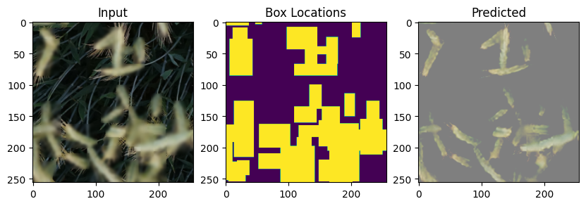

# Self Supervised Pretraining using Autoencoders to detect multiple objects

## Methodology
- The Model was trained using pixel wise mean square error loss with additional penalty added to pixels within a bounding box.
- Dataset prepared by blurring wheat heads(X) to reconstruct the image with wheat heads(Y)
- Global Wheat Dataset,2021 was used to pretrain the model
  

## Architecture
|Architecture|Description|
|-|----|
|Backbone|CSPDarknet-53|
|Decoder|Inverse CSPDarknet-53|
|Skip Connections|Between Residual Blocks from encoder to decoder|

## Usage
- To improve detections on YOLO models by learning a set of weights before fine tuning.
- Detects multiple objects in the same image
- Saves on computation cost while training object detectors from scratch